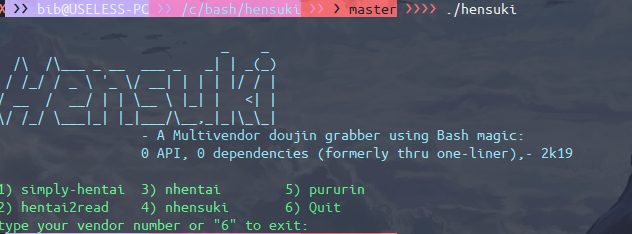

    <h2>Hensuki</h2>

     

----

## Hensuki 
A Multivendor doujin grabber / downloader using Bash magic:  
0 API, 0 dependencies (formerly thru one-liner) supported several site. 

## Getting started  
  
Clone this repo and run `./hensuki` as usual

## Docs
Pls take a look and read it if it helps you [Wiki](https://github.com/sinkaroid/hensuki/wiki)

## Supported site
- nhentai.net
- hentai2read.com
- www.simply-hentai.com
- pururin.io
- hentai.cafe (deprecated [#is_hentai_cafe_down_or_shut_down](https://www.reddit.com/r/SauceSharingCommunity/comments/m16f08/is_hentai_cafe_down_or_shut_down/))
- hentainexus.com (deprecated [#hentainexus_is_permanently_shut_down_no_thanks_to](https://www.reddit.com/r/Piracy/comments/lv1mcs/hentainexus_is_permanently_shut_down_no_thanks_to/))

## Todo
- [X] nhentai
- [X] hentai2read
- [X] ~~hentaicafe~~
- [X] ~~hentainexus~~
- [X] nhensuki (for blocked country)
- [X] pururin
- [ ] hitomi
- [ ] exhentai

## Legal

This tool can be freely copied, modified, altered, distributed without any attribution whatsoever. However, if you feel like this tool deserves an attribution, mention it. It won't hurt anybody :)

Please, read the [license terms](/LICENSE). Don't worry, it can be read in less than 30 seconds, unless you have some sort of reading disability - in that case, I'm wondering why you're still reading this text. Really. Stop. Please. I mean, seriously. Why are you still reading?

## Changelogs
*@2.0 (current)*  
*codename "__nanjo__"*  

-- may-07-21
- **refactor(*)**: lots of changes
- **ci**: pipeline enjoyer
- **fix**: nhentai gif images blank result
- no more hentainexus and hentai.cafe 

## EOF:
- @sinkaroid are not the best coder, so there are sure some problematic Coding decision. I'm always happy to receive Pull requests to improve things.